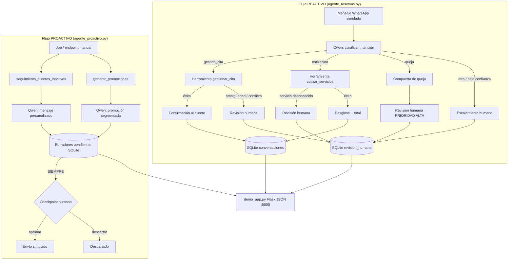

# GlamCode Autopilot Agent

Proyecto de demostración para hackathon: un **agente autónomo** para un salón de belleza ficticio, inspirado en [GlamCode OS](https://glamcode.co) (SaaS de gestión para salones en Colombia, en producción con datos reales).

> **Importante:** Este repositorio es **independiente y público**. Contiene solo un módulo de agente reconstruido con **datos ficticios** por confidencialidad. No incluye credenciales, clientes reales ni código del producto en producción.

## Motor de razonamiento

- **Qwen Cloud API** (formato OpenAI-compatible `/v1/chat/completions`)
- Variables configurables vía `.env` (ver `.env.example`)

## Arquitectura: dos flujos separados



### Checkpoints humanos (buena práctica de diseño)

| Situación | Flujo | Acción |
|-----------|-------|--------|
| Queja del cliente | Reactivo | **Siempre** escala — el agente nunca resuelve quejas solo |
| Intención "otro" o confianza baja | Reactivo | Escala — no improvisa |
| Cita ambigua, conflicto de horario | Reactivo | Escala |
| Servicio no encontrado en catálogo | Reactivo | Escala |
| Seguimiento a inactivos | Proactivo | **Todos** los mensajes son borradores |
| Promociones segmentadas | Proactivo | **Todos** los mensajes son borradores |

## Estructura del proyecto

```
glamcode-autopilot-agent/
├── agente_reservas.py    # Flujo REACTIVO completo
├── agente_proactivo.py   # Flujo PROACTIVO (jobs + borradores)
├── revision_humana.py    # Persistencia SQLite compartida
├── mock_data.py          # Datos ficticios del salón
├── qwen_client.py        # Cliente Qwen Cloud (OpenAI-compatible)
├── demo_app.py           # API Flask JSON + CORS
├── requirements.txt
├── .env.example
├── LICENSE               # MIT
└── README.md
```

## Requisitos

- Python 3.10+
- API key de [Qwen Cloud](https://qwen.ai/) / DashScope

## Instalación y ejecución local

```bash
# 1. Clonar e instalar dependencias
cd glamcode-autopilot-agent
python -m venv .venv
source .venv/bin/activate   # Windows: .venv\Scripts\activate
pip install -r requirements.txt

# 2. Configurar variables de entorno
cp .env.example .env
# Editar .env y agregar QWEN_API_KEY

# 3. Iniciar la API (puerto 5000)
python demo_app.py
```

La base SQLite `glamcode_agent.db` se crea automáticamente al arrancar.

## Endpoints API

| Método | Ruta | Descripción |
|--------|------|-------------|
| `GET` | `/api/health` | Health check |
| `POST` | `/api/simular-mensaje` | Flujo reactivo |
| `POST` | `/api/ejecutar-seguimiento-proactivo` | Flujo proactivo |
| `GET` | `/api/revision-humana` | Listar pendientes |
| `POST` | `/api/revision-humana/<id>/aprobar` | Aprobar y simular envío |
| `POST` | `/api/revision-humana/<id>/descartar` | Descartar borrador/tarea |

CORS está habilitado para consumo desde un frontend Next.js en otro puerto.

## Probar con curl

### Health check

```bash
curl -s http://localhost:5000/api/health | jq
```

### Flujo reactivo — cotización

```bash
curl -s -X POST http://localhost:5000/api/simular-mensaje \
  -H "Content-Type: application/json" \
  -d '{"mensaje": "Hola, ¿cuánto cuesta manicure + pedicure + cejas?"}' | jq
```

### Flujo reactivo — agendar cita

```bash
curl -s -X POST http://localhost:5000/api/simular-mensaje \
  -H "Content-Type: application/json" \
  -d '{"mensaje": "Quiero agendar un corte de cabello dama para el viernes a las 11:00, soy Ana, tel 300-999-0000"}' | jq
```

### Flujo reactivo — queja (escalamiento obligatorio)

```bash
curl -s -X POST http://localhost:5000/api/simular-mensaje \
  -H "Content-Type: application/json" \
  -d '{"mensaje": "Me cobraron de más la última vez y el servicio fue malísimo"}' | jq
```

### Flujo proactivo — disparar jobs

```bash
curl -s -X POST http://localhost:5000/api/ejecutar-seguimiento-proactivo \
  -H "Content-Type: application/json" \
  -d '{"dias_umbral": 30, "incluir_promociones": true}' | jq
```

### Listar tareas y borradores pendientes

```bash
curl -s "http://localhost:5000/api/revision-humana?estado=pendiente" | jq
```

### Aprobar un borrador (simula envío)

```bash
curl -s -X POST http://localhost:5000/api/revision-humana/1/aprobar | jq
```

### Descartar un item

```bash
curl -s -X POST http://localhost:5000/api/revision-humana/2/descartar | jq
```

## Variables de entorno

| Variable | Descripción |
|----------|-------------|
| `QWEN_API_KEY` | API key de Qwen Cloud (requerida) |
| `QWEN_API_BASE_URL` | URL base OpenAI-compatible (default: DashScope intl) |
| `QWEN_MODEL` | Modelo Qwen (default: `qwen-plus`) |
| `DIAS_INACTIVIDAD` | Umbral de días para clientes inactivos (default: 30) |
| `PORT` | Puerto del servidor (default: 5000) |

## Licencia

MIT — ver [LICENSE](LICENSE).
